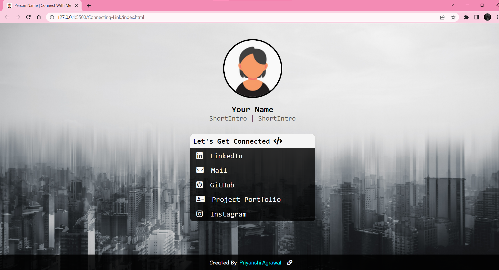
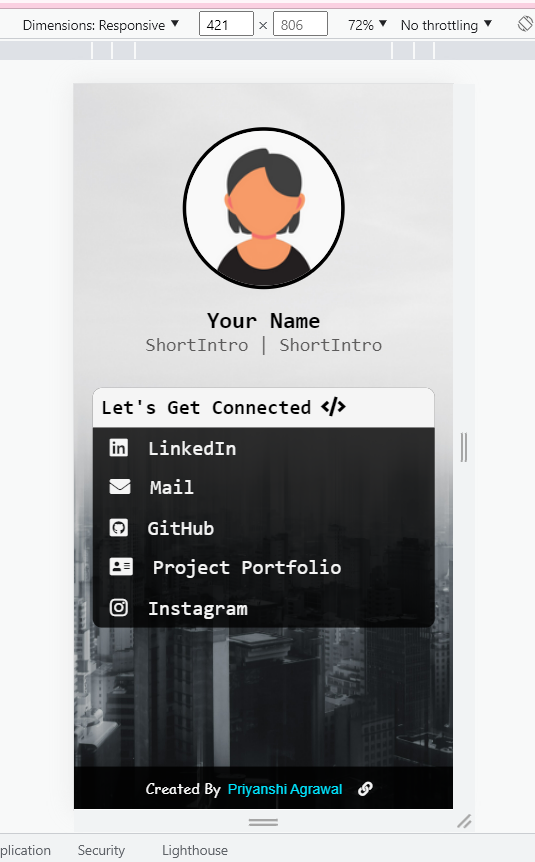
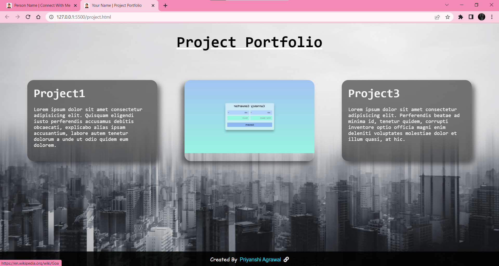
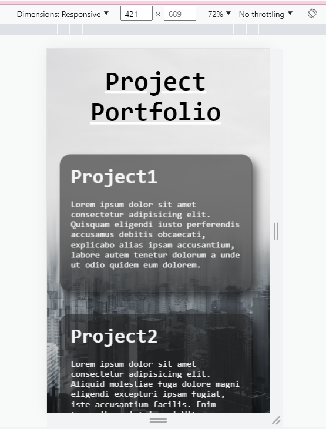

# Connecting Link

## Description :-

A simple page with collection of all your links which you would like to share with others to get connected.
Project Portfolio will display your desired projects here.

## Tech Stack :-

- HTML
- CSS

## Run Local

* Clone this repository

```bash
git clone https://github.com/priyanshi1282/connecting-link-template
```


* Open `index.html` in browser.

## Screenshot




